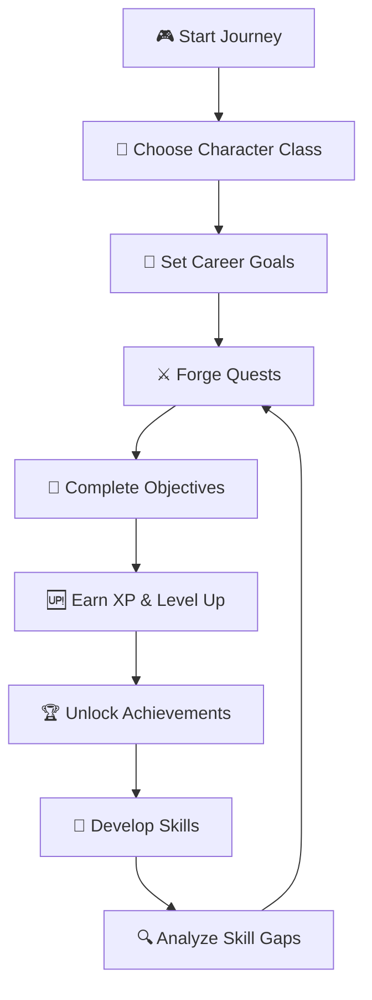

<div align="center">

# 🎮 ChiquiQuest AI ⚔️
### *Transform Your Career Into an Epic RPG Adventure* 🌟

[](https://nextjs.org/)
[](https://react.dev/)
[](https://www.typescriptlang.org/)
[](https://tailwindcss.com/)
[](LICENSE)

**Gamified AI-Powered Career Development Platform** 🚀

*Level up your tech skills, complete epic quests, and become a legendary developer!* 🏆

</div>

---

## 📖 Table of Contents

- [✨ Features](#-features)
- [🎯 How It Works](#-how-it-works)
- [🏰 Character Classes](#-character-classes)
- [🎮 Game Mechanics](#-game-mechanics)
- [🛠️ Tech Stack](#️-tech-stack)
- [🚀 Getting Started](#-getting-started)
- [📁 Project Structure](#-project-structure)
- [🎨 Components](#-components)
- [🔧 Configuration](#-configuration)
- [🤝 Contributing](#-contributing)
- [📄 License](#-license)

---

## ✨ Features

### 🎭 **Hero Creation System**
- Choose your archetype from 4 unique character classes
- Customize your hero with a legendary name
- Start your journey with unique base stats

### ⚔️ **Quest Forge**
- Transform career goals into actionable RPG quests
- AI-powered quest generation using Hugging Face
- Track progress with XP rewards and difficulty levels
- Complete objectives to level up! 🆙

### 🌳 **Skill Tree**
- Visual representation of your tech skills
- Track your learning progression
- Plan your skill development path

### 🔍 **Gap Analyzer**
- AI-powered skill gap analysis
- Identify knowledge gaps between current and target roles
- Get personalized learning paths
- Unlock the "Knowledge Scout" badge! 🎖️

### 📊 **Dashboard Stats**
- Real-time level and XP tracking
- Character class information
- Base attributes display (Logic, Stability, Creativity, Speed)
- Achievement showcase

### 🏆 **Achievement System**
- Unlock badges as you progress
- Track milestones in your journey
- Showcase your accomplishments

### 🔮 **Arcane Knowledge**
- AI-powered documentation search
- Find answers to your technical questions
- Learn from the wisdom of the code gods

### 🎨 **Beautiful UI**
- Neon-themed cyberpunk aesthetic
- Smooth animations with Framer Motion
- Responsive design for all devices
- Dark mode optimized

---

## 🎯 How It Works



### 🔄 User Flow

1. **🏁 Onboarding** - Create your hero and choose your class
2. **🎯 Goal Setting** - Define your career aspirations
3. **⚔️ Quest Generation** - AI creates personalized quests
4. **📋 Task Completion** - Complete real-world learning tasks
5. **🆙 Progression** - Earn XP and level up
6. **🏆 Achievement Unlocking** - Collect badges
7. **🔄 Continuous Improvement** - Analyze gaps and repeat

---

## 🏰 Character Classes

### ⚔️ Code Knight
> *Masters of architecture and clean code. Defends the realm with robust patterns.*

```
📊 Base Stats:
┌─────────────────────────┐
│ Logic:     ████████░░ 8 │
│ Creativity: █████░░░░░ 5 │
│ Stability: █████████░ 9 │
│ Speed:     ████░░░░░░ 4 │
└─────────────────────────┘
```

### 🎨 Pixel Paladin
> *Guardians of user experience and visual harmony. Brushes are their weapons.*

```
📊 Base Stats:
┌─────────────────────────┐
│ Logic:     █████░░░░░ 5 │
│ Creativity: █████████░ 9 │
│ Stability: ██████░░░░ 6 │
│ Speed:     ██████░░░░ 6 │
└─────────────────────────┘
```

### ☁️ Cloud Conjuror
> *Weavers of distributed systems and serverless magic. Scales the unreachable.*

```
📊 Base Stats:
┌─────────────────────────┐
│ Logic:     █████████░ 9 │
│ Creativity: ██████░░░░ 6 │
│ Stability: ███████░░░ 7 │
│ Speed:     █████░░░░░ 5 │
└─────────────────────────┘
```

### 🛡️ Security Sentinel
> *Protectors of the digital gate. Detects threats before they manifest.*

```
📊 Base Stats:
┌─────────────────────────┐
│ Logic:     ███████░░░░ 7 │
│ Creativity: ████░░░░░░ 4 │
│ Stability: ███████████10│
│ Speed:     ██████░░░░ 6 │
└─────────────────────────┘
```

---

## 🎮 Game Mechanics

### 📈 Leveling System
- **XP Formula**: 1000 XP per level
- **Level Progress**: Tracked in real-time
- **Visual Feedback**: Progress bars and animations

### 🎖️ Achievement Badges

| Badge | Name | Description | Requirement |
|-------|------|-------------|-------------|
| 👶 | Digital Newborn | Completed your first class archetype discovery | Onboarding complete |
| 📜 | Initiate Adventurer | Forged your first set of career quests | First quest forge |
| 🔍 | Knowledge Scout | Analyzed your first skill gap | First gap analysis |

### ⚔️ Quest System
- **Difficulty Levels**: Easy, Medium, Hard
- **XP Rewards**: Based on difficulty
- **Completion Tracking**: Visual progress indicators
- **AI Generation**: Personalized to your goals

---

## 🛠️ Tech Stack

### 🎯 Frontend Framework
- **Next.js 15.4** - React framework with App Router
- **React 19.2** - UI library
- **TypeScript 5.9** - Type safety

### 🎨 Styling
- **Tailwind CSS 3.4** - Utility-first CSS
- **Framer Motion** - Animations
- **Lucide React** - Icon library
- **shadcn/ui** - Component library

### 🧠 AI Integration
- **Hugging Face Inference** - AI model inference
- **@google/genai** - Google AI integration

### 📊 State Management
- **Zustand** - Lightweight state management
- **React Context** - Hero state management

### 🔧 Utilities
- **Zod** - Schema validation
- **clsx & tailwind-merge** - Class name utilities
- **react-markdown** - Markdown rendering

### 🎨 Additional Features
- **html2canvas & jsPDF** - Export functionality
- **Recharts** - Data visualization
- **Firebase** - Backend integration

---

## 🚀 Getting Started

### 📋 Prerequisites

- **Node.js** 18+ 
- **npm** or **yarn**
- **Hugging Face API Token** (for AI features)

### 🔧 Installation

```bash
# Clone the repository
git clone https://github.com/Orliluq/chiquiquest-ai.git
cd chiquiquest-ai

# Install dependencies
npm install

# Set up environment variables
cp .env.example .env
```

### ⚙️ Environment Variables

Create a `.env` file with the following variables:

```env
# Hugging Face API Token
HF_TOKEN=your_hugging_face_token_here

# App URL (optional)
APP_URL=http://localhost:3000
```

### 🎮 Running the App

```bash
# Development mode
npm run dev

# Build for production
npm run build

# Start production server
npm start

# Run linter
npm lint

# Clean build artifacts
npm run clean
```

Open [http://localhost:3000](http://localhost:3000) in your browser! 🎉

---

## 📁 Project Structure

```
chiquiquest-ai/
├── 📁 src/
│   ├── 📁 app/                    # Next.js App Router
│   │   ├── 📁 api/               # API routes
│   │   │   └── generate/         # AI quest generation
│   │   ├── 📁 dashboard/         # Dashboard page
│   │   ├── 📁 onboarding/        # Hero creation
│   │   ├── layout.tsx            # Root layout
│   │   ├── page.tsx              # Home page
│   │   └── globals.css           # Global styles
│   ├── 📁 assets/                # Static assets
│   │   └── rpg.png               # RPG world image
│   ├── 📁 components/            # React components
│   │   ├── 📁 ui/                # shadcn/ui components
│   │   ├── ArcaneKnowledge.tsx   # Documentation search
│   │   ├── DashboardStats.tsx    # Stats display
│   │   ├── GapAnalyzer.tsx      # Skill gap analysis
│   │   ├── QuestForge.tsx        # Quest generation
│   │   ├── RPGForm.tsx          # RPG-styled forms
│   │   └── SkillTree.tsx         # Skill visualization
│   ├── 📁 hooks/                 # Custom React hooks
│   │   └── use-toast.ts         # Toast notifications
│   └── 📁 lib/                   # Utilities
│       ├── chiquiquest-schema.ts # Zod schemas
│       ├── game-data.ts          # Game constants
│       ├── hero-store.tsx        # Hero state management
│       ├── normalize-chiquiquest.ts # Data normalization
│       └── utils.ts             # Utility functions
├── 📁 public/                    # Public assets
├── .env.example                 # Environment variables template
├── .gitignore                   # Git ignore rules
├── components.json              # shadcn/ui configuration
├── next.config.ts              # Next.js configuration
├── package.json                # Dependencies
├── postcss.config.mjs          # PostCSS configuration
├── tailwind.config.ts          # Tailwind configuration
└── tsconfig.json               # TypeScript configuration
```

---

## 🎨 Components

### 🎮 Core Components

#### **DashboardStats**
Displays hero information including:
- Character class and icon
- Current level and XP progress
- Base attributes with visual bars
- Achievement count

#### **QuestForge**
AI-powered quest generation:
- Input career goals
- Generate personalized quests
- Track quest completion
- Earn XP rewards

#### **SkillTree**
Visual skill management:
- Display current skills
- Track skill progression
- Plan learning paths

#### **GapAnalyzer**
Skill gap analysis:
- Compare current vs target skills
- AI-powered gap identification
- Personalized learning recommendations
- Unlock achievements

#### **ArcaneKnowledge**
Documentation search:
- AI-powered search
- Markdown rendering
- Technical knowledge base

### 🎨 UI Components

Built with **shadcn/ui**:
- Button, Input, Textarea
- Card, Badge, Progress
- Tabs, Dialog, and more!

---

## 🔧 Configuration

### 🎨 Tailwind CSS

Custom theme with:
- **Neon color palette** (cyan, purple, blue)
- **Custom animations** (flicker, liquid-transition)
- **Dark mode optimized**
- **CSS variables** for theming

### 🎯 Next.js

- **App Router** for routing
- **Server Components** for performance
- **Client Components** for interactivity
- **API Routes** for backend logic

### 🔐 Firebase

Ready for Firebase integration:
- Authentication
- Database
- Storage
- Analytics

---

## 🤝 Contributing

Contributions are welcome! 🎉

1. Fork the repository
2. Create a feature branch (`git checkout -b feature/amazing-feature`)
3. Commit your changes (`git commit -m 'Add some amazing feature'`)
4. Push to the branch (`git push origin feature/amazing-feature`)
5. Open a Pull Request

### 📝 Development Guidelines

- Follow the existing code style
- Add comments for complex logic
- Test your changes thoroughly
- Update documentation as needed

---

## 🐛 Known Issues

- Hydration warnings from browser extensions (suppressed with `suppressHydrationWarning`)
- Some components need client-side hydration for localStorage data
- Image imports require Next.js optimization

---

## 🗺️ Roadmap

### 🚧 Upcoming Features

- [ ] 🌐 Multiplayer leaderboard
- [ ] 🎴 Skill card collection system
- [ ] 🏰 Guild system for team collaboration
- [ ] 📱 Mobile app (React Native)
- [ ] 🎵 Sound effects and music
- [ ] 🌍 Multiple language support
- [ ] 🔔 Push notifications
- [ ] 📊 Advanced analytics dashboard
- [ ] 🤖 More AI integration
- [ ] 🎴 NFT achievement badges

---

## 📄 License

This project is licensed under the MIT License - see the [LICENSE](LICENSE) file for details.

---

## 🙏 Acknowledgments

- **Next.js team** for the amazing framework
- **shadcn** for the beautiful UI components
- **Hugging Face** for AI model access
- **Lucide** for the icon library
- **Framer Motion** for smooth animations

---

## 📞 Support

- 📧 Email: support@chiquiquest.ai
- 🐛 Issues: [GitHub Issues](https://github.com/Orliluq/chiquiquest-ai/issues)
- 💬 Discord: [Join our community](https://discord.gg/chiquiquest)

---

<div align="center">

## 🎮 Start Your Adventure Today! ⚔️

**Made with ❤️ by [Orliluq](https://github.com/Orliluq)**

*Level up your career, one quest at a time!* 🚀

[⬆ Back to Top](#-chiquiquest-ai-️)

</div>
